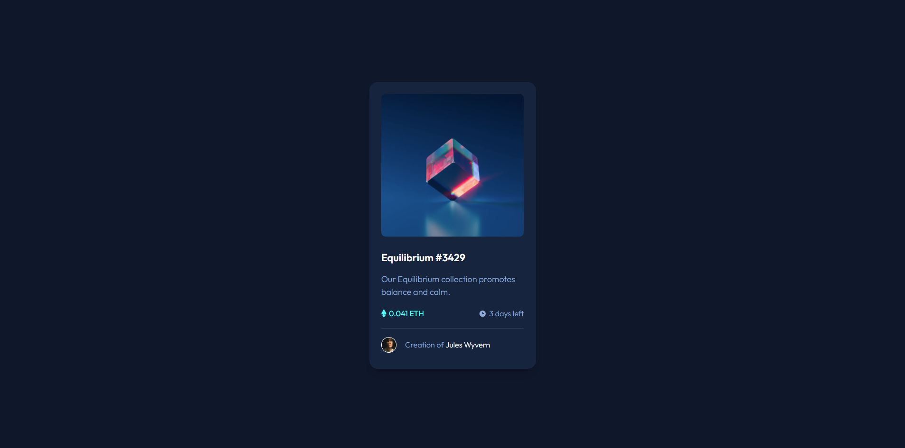

# Frontend Mentor - NFT preview card component solution

This is a solution to the [NFT preview card component challenge on Frontend Mentor](https://www.frontendmentor.io/challenges/nft-preview-card-component-SbdUL_w0U). Frontend Mentor challenges help you improve your coding skills by building realistic projects.

## Table of contents

- [Overview](#overview)
  - [The challenge](#the-challenge)
  - [Screenshot](#screenshot)
  - [Links](#links)
- [My process](#my-process)
  - [Built with](#built-with)
  - [What I learned](#what-i-learned)
  - [Continued development](#continued-development)
  - [Useful resources](#useful-resources)
- [Author](#author)
- [Acknowledgments](#acknowledgments)

**Note: Delete this note and update the table of contents based on what sections you keep.**

## Overview - [Live-Demo](https://youtu.be/exb2ab72Xhs)

### The challenge

Users should be able to:

- View the optimal layout depending on their device's screen size
- See hover states for interactive elements

### Screenshot



## My process

Mainly used flexbox and baisc CSS

### Built with

- Semantic HTML5 markup
- CSS custom properties
- Flexbox

### What I learned

Handy subtle overlay animation that I liked. I learned it from youtube.

```css
.card__image__overlay {
  cursor: pointer;
  position: absolute;
  display: flex;
  justify-content: center;
  align-items: center;
  transition: opacity 0.2s;
}

.card__image__overlay:hover {
  opacity: 1;
}

.card__image__overlay > * {
  transform: translateY(1rem);
  transition: transform 0.2s;
}

.card__image__overlay:hover > * {
  transform: translateY(0);
}
```

### Continued development

I did not understand why height 100% on overlay did not cover the image 100%, I still need to look into it.

### Useful resources

- [Overlay](https://youtu.be/exb2ab72Xhs)

## Author

- Frontend Mentor - [@YeongOh](https://www.frontendmentor.io/profile/YeongOh)
